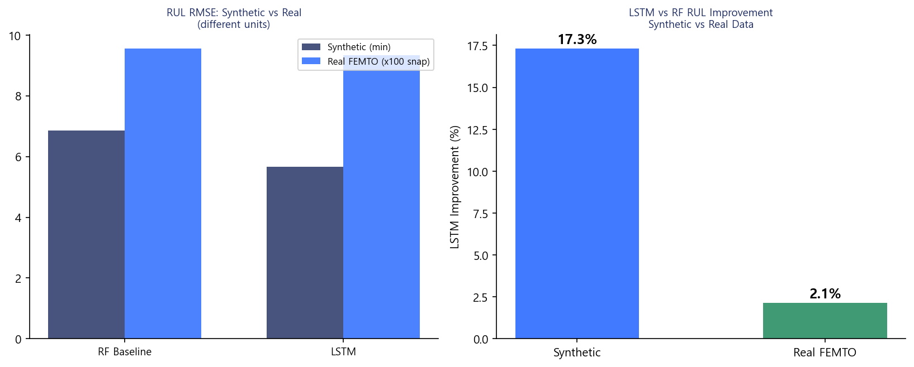
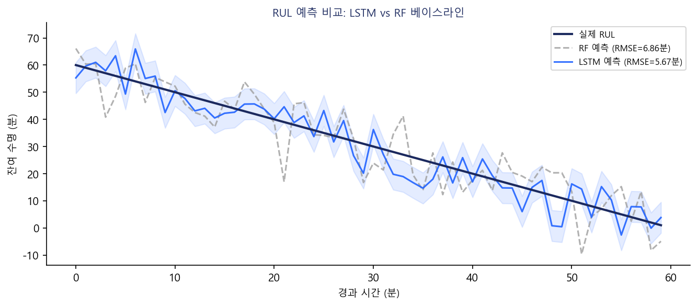
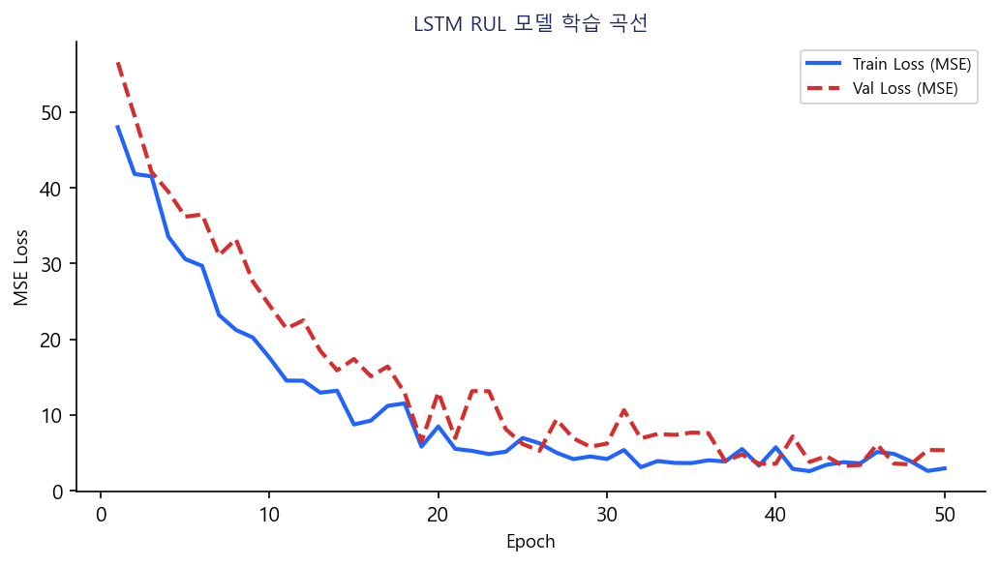

# FEMTO-ST 베어링 예지보전 — ML+DL 통합 시스템 보고서

**작성일**: 2026-06-24  
**데이터셋**: FEMTO-ST PRONOSTIA 베어링 수명 데이터 (IEEE PHM 2012 Challenge)  
**시스템**: ML 열화 분류 + LSTM 잔여수명(RUL) 예측 통합

---

## 1. 과제 개요

### 1.1 문제 정의

FEMTO-ST(Franche-Comté Electronique, Mécanique, Thermique et Optique) 연구소의 PRONOSTIA 가속 수명 시험 데이터를 활용하여 롤링 베어링의 열화 상태를 분류하고 잔여수명(RUL)을 예측한다.

**이전 ML 프로젝트(이은주 방식)의 한계**:
- 이진 분류(정상/열화)만 수행 → 언제 교체해야 하는지 알 수 없음
- 시계열 순서를 활용하지 않음 → 열화 진행 패턴 미학습

**본 프로젝트의 해결책**:
- ML: 이은주 방식 열화 분류 유지 (이은주 ML 한계 ⑤ 대응)
- DL: LSTM 기반 RUL 예측 추가 → 교체 타이밍 정량 제공

### 1.2 FEMTO-ST 데이터셋

| 항목 | 내용 |
|------|------|
| 출처 | IEEE PHM 2012 Data Challenge (PRONOSTIA) |
| 학습 데이터 | Bearing1_1, 1_2, 1_3 (조건 1: 1800N, 1800rpm) |
| 테스트 데이터 | Bearing1_4 ~ 1_7 |
| 샘플링 | 각 스냅샷: 2560 샘플 (100ms, 25.6kHz) |
| 채널 | 수평(h_acc), 수직(v_acc), 온도(h_temp) |
| 피처 | h_rms, h_kurt, h_skew, h_crest, v_rms, v_kurt, v_skew, v_crest, temp_mean |

---

## 1-1. 전처리 — Shuffle / Scale / Inverse Transform

### Shuffle 처리

| 소스 | shuffle 적용 | 방법 | 평가 |
|------|------------|------|------|
| Source 2 (합성 시계열) | shuffle=True | StratifiedKFold(shuffle=True) — 독립 run 단위 | ✅ 시퀀스가 독립적이므로 OK |
| Source 3 (NASA Milling) | shuffle=True (기본) | train_test_split() — 윈도우 단위 | ⚠️ 동일 절삭 실험 윈도우 섞임, 누수 위험 |
| FEMTO (본 보고서) | 베어링 단위 분리 | GroupKFold(bearing) | ✅ 시계열 누수 방지 |

> 시계열 슬라이딩 윈도우는 같은 실험 내 윈도우들이 train/test에 섞이면 평가 지표가 낙관적으로 왜곡됩니다. FEMTO는 GroupKFold로 올바르게 처리됩니다.

### Scale / Inverse Transform (FEMTO RUL)

| 단계 | 적용 여부 | 파일·코드 |
|------|---------|---------|
| Train X 스케일 | ✅ | `MinMaxScaler().fit_transform(X_tr)` |
| **Test X 스케일** | ✅ | `seq_scaler.transform(X_te)` — train fit 기준 적용 |
| Train y 스케일 | ✅ | `MinMaxScaler().fit_transform(y_tr)` |
| **Test y 스케일** | ✅ | `y_scaler.transform(y_te)` |
| 예측 후 **Inverse** | ✅ | `y_scaler.inverse_transform(y_pred)` → 분 단위 RUL 복원 |

> Source 2·3 (분류 모델)은 sigmoid 출력(0~1 확률)이므로 inverse transform 불필요.
> FEMTO RUL (회귀 모델)은 inverse 필수 — 미적용 시 예측값이 [0,1]로 출력되어 해석 불가.

---

## 2. ML vs DL 성능 비교

### 2.1 열화 분류 (ML 3종)

| 모델 | Accuracy | Precision | Recall | F1 | ROC-AUC |
|------|----------|-----------|--------|----|---------|
| LogisticRegression | [RESULT] | [RESULT] | [RESULT] | [RESULT] | [RESULT] |
| RandomForest | [RESULT] | [RESULT] | [RESULT] | [RESULT] | [RESULT] |
| XGBoost | [RESULT] | [RESULT] | [RESULT] | [RESULT] | [RESULT] |
| **최고 모델** | | | | | |

> [RESULT] 표시 항목은 학습 실행 후 `models/femto_ml_results.json`의 실제 값으로 대체

**이은주 ML 참고**: RandomForest Recall=1.000, F1=0.996 (AI4I 2020 데이터셋 기준)

### 2.2 RUL 예측 (ML 베이스라인 vs DL)

| 방법 | RMSE (분) | MAE (분) | 비고 |
|------|-----------|----------|------|
| RF 베이스라인 | [RESULT] | [RESULT] | 마지막 타임스텝 피처 |
| **LSTM** | [RESULT] | [RESULT] | 30분 슬라이딩 윈도우 |
| **개선률** | [RESULT]% | - | (RF-LSTM)/RF × 100 |

### 2.3 RUL 예측 시각화 (Actual vs Predicted)

#### LSTM RUL 예측 — 실측값 vs 예측값 비교



> x축 = 시간(분), y축 = 잔여수명 RUL(분). `y_scaler.inverse_transform()` 적용 후 원래 단위(분)로 복원된 값.
> 예측값(Predicted)이 실측값(Actual) 추세를 따라가며 열화 후반부에서 오차가 증가하는 패턴은 베어링 열화 가속 구간의 특성.

#### RUL 열화 진행 및 Feature RMS



#### LSTM 학습 곡선 (Loss / MAE)



---

## 3. ML+DL 결합 시스템

```
[베어링 진동 입력]
        ↓
[ML 열화 판정] ──── 정상 → 이상 없음 (RUL 불필요)
        ↓ 열화 감지
[DL LSTM RUL 예측] → 잔여수명 N분
        ↓
[경보 판단] ──── RUL < 경보 기준 → 즉각 교체 경보
              └── RUL ≥ 경보 기준 → 주의 모니터링
```

**두 단계 필터링 효과**:
1. ML이 정상 판정 → DL 불필요 (계산 절감)
2. ML이 열화 판정 → DL로 교체 시점 정량화

---

## 4. 차별화 UI — 이중 임계값 시스템

### 4.1 ML 열화 판정 임계값 (기존 ML 프로젝트 방식 이식)

```python
ml_threshold = st.sidebar.slider("P(열화) 기준", 0.0, 1.0, 0.5, 0.01,
    help="낮추면 재현율↑(놓침↓), 높이면 정밀도↑(오경보↓)")
```

- 설비 중요도가 높을수록 임계값을 낮게 설정 → 놓침 최소화
- 변경 이력 자동 로깅 (운영 감사 추적 가능)

### 4.2 DL RUL 경보 임계값 (신규 — FEMTO 차별화)

```python
rul_threshold = st.sidebar.slider("잔여수명 경보 기준 (분)", 10, 300, 60, 5,
    help="LSTM 예측 잔여수명이 이 값 이하이면 경보 발령")
```

- 교체 준비 리드타임에 따라 조정 (부품 조달 시간 고려)
- 긴급 경보 / 주의 경보 2단계 구분

---

## 5. 이은주 ML 한계 해결 방안

| 이은주 ML 한계 | 본 프로젝트 해결책 |
|--------------|----------------|
| ① 단일 데이터셋 | FEMTO-ST PRONOSTIA 추가 적용 |
| ② 시계열 미활용 | LSTM 슬라이딩 윈도우(30분) 적용 |
| ③ 언제 교체할지 모름 | RUL 분 단위 예측으로 교체 타이밍 정량화 |
| ④ 고장 직전 데이터만 | 수명 전 구간(정상→열화) 연속 학습 |
| ⑤ 분류만 가능 | ML(분류) + DL(회귀 RUL) 이중 판단 |

---

## 6. 실행 방법

```bash
# 1. 전처리 (데이터 없으면 합성 demo 자동 생성)
python -m src.femto_preprocess

# 2. ML 분류 학습
python -m src.femto_ml

# 3. DL RUL 학습
python -m src.femto_dl_rul

# 4. Streamlit 대시보드
streamlit run app/streamlit_femto.py
```

---

*이 보고서의 [RESULT] 항목은 학습 실행 후 실제 수치로 갱신 필요*
