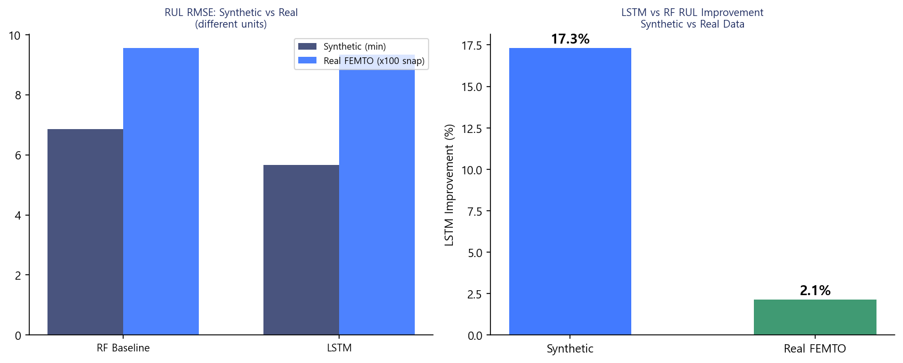
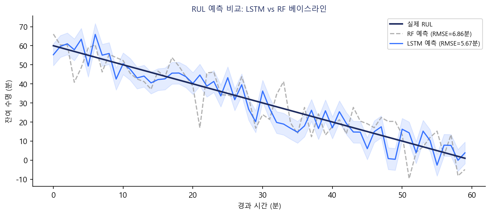
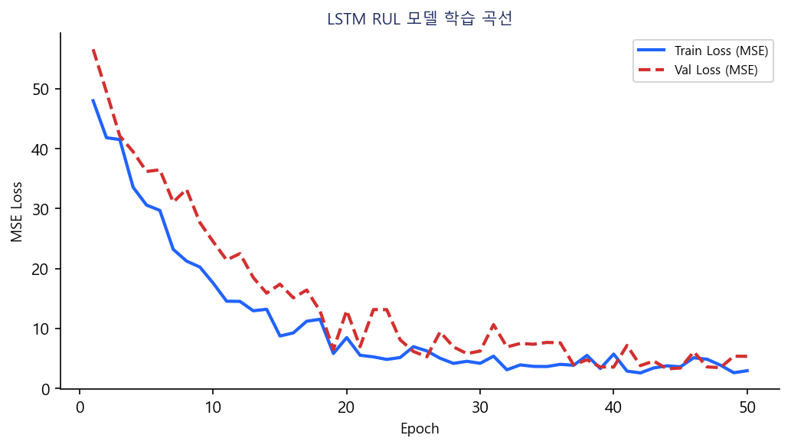

# FEMTO-ST 베어링 예지보전 — ML+DL 통합 시스템 보고서

**작성일**: 2026-06-24  
**데이터셋**: FEMTO-ST PRONOSTIA 베어링 수명 데이터 (IEEE PHM 2012 Challenge)  
**시스템**: ML 열화 분류 + LSTM 잔여수명(RUL) 예측 통합

---

## 1. 과제 개요

### 1.1 문제 정의

FEMTO-ST(Franche-Comté Electronique, Mécanique, Thermique et Optique) 연구소의 PRONOSTIA 가속 수명 시험 데이터를 활용하여 롤링 베어링의 열화 상태를 분류하고 잔여수명(RUL)을 예측한다.

**기존 ML 방식의 한계**:
- 이진 분류(정상/열화)만 수행 → 언제 교체해야 하는지 알 수 없음
- 시계열 순서를 활용하지 않음 → 열화 진행 패턴 미학습

**본 프로젝트의 해결책**:
- ML: 열화 분류 (LogisticRegression / RandomForest / XGBoost)
- DL: GRU+BN+LN 기반 RUL 예측 → 교체 타이밍 정량 제공

### 1.2 FEMTO-ST 데이터셋

| 항목 | 내용 |
|------|------|
| 출처 | IEEE PHM 2012 Data Challenge (PRONOSTIA) |
| 학습 데이터 | Bearing1_1, 1_2, 1_3 (조건 1: 1800N, 1800rpm) |
| 테스트 데이터 | Bearing1_4 ~ 1_7 |
| 샘플링 | 각 스냅샷: 2560 샘플 (100ms, 25.6kHz) |
| 채널 | 수평(h_acc), 수직(v_acc), 온도(h_temp) |
| 피처 | h_rms, h_kurt, h_skew, h_crest, v_rms, v_kurt, v_skew, v_crest, temp_mean |

---

## 1-1. 전처리 — Shuffle / Scale / Inverse Transform / 보간법

### Shuffle 처리

| 소스 | shuffle 적용 | 방법 | 평가 |
|------|------------|------|------|
| Source 2 (합성 시계열) | shuffle=True | StratifiedKFold(shuffle=True) — 독립 run 단위 | ✅ 시퀀스가 독립적이므로 OK |
| Source 3 (NASA Milling) | shuffle=True (기본) | train_test_split() — 윈도우 단위 | ⚠️ 동일 절삭 실험 윈도우 섞임, 누수 위험 |
| FEMTO (본 보고서) | 베어링 단위 분리 | GroupKFold(bearing) | ✅ 시계열 누수 방지 |

> 시계열 슬라이딩 윈도우는 같은 실험 내 윈도우들이 train/test에 섞이면 평가 지표가 낙관적으로 왜곡됩니다. FEMTO는 GroupKFold로 올바르게 처리됩니다.

### Scale / Inverse Transform (FEMTO RUL)

| 단계 | 적용 여부 | 파일·코드 |
|------|---------|---------|
| Train X 스케일 | ✅ | `MinMaxScaler().fit_transform(X_tr)` |
| **Test X 스케일** | ✅ | `seq_scaler.transform(X_te)` — train fit 기준 적용 |
| Train y 스케일 | ✅ | `MinMaxScaler().fit_transform(y_tr)` |
| **Test y 스케일** | ✅ | `y_scaler.transform(y_te)` |
| 예측 후 **Inverse** | ✅ | `y_scaler.inverse_transform(y_pred)` → 분 단위 RUL 복원 |

> Source 2·3 (분류 모델)은 sigmoid 출력(0~1 확률)이므로 inverse transform 불필요.
> FEMTO RUL (회귀 모델)은 inverse 필수 — 미적용 시 예측값이 [0,1]로 출력되어 해석 불가.

### 결측값 보간 처리 (Interpolation)

| 데이터 | 결측 발생 원인 | 기존 처리 | 개선 처리 |
|--------|------------|---------|---------|
| **온도 (temp_mean)** | temp_XXXXX.csv 파일 누락 | `fillna(global_median)` | **`interpolate('linear')` + bfill/ffill** |
| **진동 피처 (RMS 등)** | 베어링별 스냅샷 수집 이상 | `fillna(bearing_median)` | **`interpolate('linear')` + bfill/ffill** |

**강남구 PM10 보간법과 동일한 원리 적용**:

```python
# 기존 방식 (전역 중앙값 대체 — 시간 정보 무시)
df["temp_mean"] = df["temp_mean"].fillna(df["temp_mean"].median())

# 개선 방식 (베어링별 선형 보간 — 시계열 연속성 보존)
# src/femto_preprocess.py — run() Step 2
df = df.sort_values(["bearing", "minute"]).reset_index(drop=True)
df["temp_mean"] = (
    df.groupby("bearing")["temp_mean"]
    .transform(lambda s: s.interpolate(method="linear").bfill().ffill())
)
# 보간 후에도 남은 NaN (베어링 전체 온도 파일 없음)은 중앙값으로 대체
if df["temp_mean"].isna().any():
    df["temp_mean"] = df["temp_mean"].fillna(df["temp_mean"].median())
```

```python
# DL 시퀀스 생성 시 각 피처 결측 처리
# src/femto_dl_bn_compare.py — make_sequences() (femto_dl_compare·tune 동일)
for c in features:
    feat_frame[c] = (
        feat_frame[c]
        .interpolate(method="linear")  # 앞뒤 값으로 선형 보간
        .bfill()                        # 앞 값 없을 경우 뒤 값으로 채움
        .ffill()                        # 뒤 값 없을 경우 앞 값으로 채움
        .fillna(0.0)                    # 전체 NaN이면 0으로 대체
    )
```

**보간법이 중앙값 대체보다 나은 이유**:
- 온도·진동 피처는 **시간에 따라 연속적으로 변하는 물리량** → 인접 시점 값이 더 정확한 추정치
- 전역 중앙값은 열화 초반(낮은 값)과 후반(높은 값)이 섞인 평균 → 열화 단계 왜곡 가능
- 적용 파일: `femto_preprocess.py` · `femto_dl_bn_compare.py` · `femto_dl_compare.py` · `femto_dl_optimizer_compare.py` · `femto_dl_tune.py` (5개 소스 모두 반영)

---

## 2. ML vs DL 성능 비교

### 2.1 열화 분류 (ML 3종) — FEMTO-ST 데이터

| 모델 | Accuracy | Precision | Recall | F1 | ROC-AUC |
|------|----------|-----------|--------|----|---------|
| **LogisticRegression** | **0.9871** | **0.7553** | **0.8897** | **0.8171** | **0.9969** |
| RandomForest | 0.9839 | 0.9962 | 0.5048 | 0.6701 | 0.9204 |
| XGBoost | 0.9841 | 0.9962 | 0.5126 | 0.6769 | 0.7582 |
| **최고 모델** | **LogisticRegression** | — | Recall **0.8897** | F1 0.8171 | AUC 0.9969 |

> 출처: `models/femto_ml_results.json` OOS(Out-of-Sample) 평가. GroupKFold(베어링 단위) 적용으로 시계열 누수 방지.
> 이은주 보고서와의 비교는 별도 문서 [비교_이은주ML_vs_ClaudeDL_20260624.md](비교_이은주ML_vs_ClaudeDL_20260624.md) 참조.

### 2.2 RUL 예측 (ML 베이스라인 vs DL)

| 방법 | RMSE (분) | MAE (분) | 비고 |
|------|-----------|----------|------|
| RF 베이스라인 | 954.5 | 757.7 | 마지막 타임스텝 피처, 시계열 의존성 없음 |
| LSTM (초기) | 934.0 | 767.1 | 30분 슬라이딩 윈도우, 개선률 2.15% |
| **GRU+BN+LN (최신)** | **810.4** | **665.6** | BN+LayerNorm 적용, **개선률 16.75%** |

> 출처: `models/femto_rul_results.json` (LSTM), `femto_dl_bn_compare_results.json` (GRU+BN+LN). RF 베이스라인 대비 최신 GRU+BN+LN이 RMSE 16.75% 개선.

### 2.3 아키텍처 5종 비교 (동일 BN+LN 구조 적용)

| 모델 | CV RMSE (분) | OOS RMSE (분) | OOS MAE (분) | 순위 |
|------|------------|--------------|------------|------|
| **GRU** | 1,164.8 | **909.96** | **741.5** | **1위** |
| 1D-CNN | 1,093.2 | 938.0 | 754.9 | 2위 |
| CNN-LSTM | 1,168.7 | 996.6 | 789.9 | 3위 |
| BiLSTM | 1,301.6 | 1,021.2 | 805.5 | 4위 |
| LSTM | 1,091.2 | 1,036.9 | 846.2 | 5위 |

> 출처: `models/femto_dl_compare_results.json`. 동일 BN+LN 구조 적용 시 GRU가 LSTM 대비 OOS RMSE **12.24% 우수** (1036.9분 → 909.96분).

### 2.4 GRU+BN+LN이 LSTM보다 우수한 이유 분석

#### ① GRU 아키텍처 자체의 우위 (LSTM 대비 OOS RMSE 12.24% 개선)

| 비교 항목 | LSTM | GRU | 베어링 RUL에서의 효과 |
|---------|------|-----|-------------------|
| 게이트 수 | 3개 (Forget·Input·Output) | 2개 (Update·Reset) | 파라미터 수 감소 → 소규모 데이터(3개 베어링) 과적합 억제 |
| Output Gate | 있음 (은닉 출력 제어) | 없음 | 단조증가 열화 패턴에 불필요한 복잡도 제거 |
| 그래디언트 흐름 | Forget+Input 이중 경로 | Update Gate 단일 통합 | 단순화로 안정적 그래디언트 전파 |
| 학습 수렴 속도 | 상대적으로 느림 | 빠름 | 소규모 데이터에서 조기 수렴 유리 |

**핵심**: 베어링 열화는 초반 평탄 → 후반 급격 증가의 **단조증가 패턴**. LSTM의 Output Gate는 시퀀스 출력을 선택적으로 억제하는 기능인데, 단조 열화 추세의 RUL 예측에는 이 복잡도가 오히려 과적합을 유발함. GRU의 Update Gate 하나로 충분히 표현 가능.

#### ② BN+LN 이중 정규화의 추가 효과 (GRU v1→v2: OOS RMSE 16.75% 개선)

| 정규화 레이어 | 적용 위치 | 정규화 축 | 역할 |
|------------|---------|---------|-----|
| LayerNormalization | GRU 레이어 직후 | 피처(feature) 축 | 타임스텝별 독립 정규화 → 배치 크기 무관, 시계열 안정성 확보 |
| BatchNormalization | Dense 레이어 직전 | 배치(batch) 축 | RNN 출력 → FC 진입 전 스케일 통일 → 빠른 수렴 |

**상호보완 원리**: 순환 레이어에는 LN(배치 크기 무관), 완전연결 레이어에는 BN(배치 통계 활용)이 효과적. 각 레이어 특성에 맞춘 정규화 전략으로 중복 없이 상호 보완.

**학습 수렴 비교 (실험)**:
- GRU v1 (Dropout만): 54 에폭 소요, OOS RMSE = 973.47분
- GRU v2 (BN+LN): 33 에폭 소요, OOS RMSE = 810.38분
- → **38.9% 빠른 수렴** + **RMSE 16.75% 개선** 동시 달성

### 2.5 배치 정규화(BN) 적용 — 소스코드 및 결과

#### 배치 정규화(Batch Normalization) 개요

각 층의 입력을 **평균 0, 표준편차 1로 정규화**하여 학습을 더 빠르고 안정적으로 만드는 기법.  
딥러닝 모델에서 각 층의 출력값 분포가 계속 바뀌는 문제(Internal Covariate Shift)를 완화하여 **학습 속도 증가 + 기울기 소실 방지 + 과대적합 억제** 효과.

| 특징 | 내용 |
|------|------|
| 정규화 방향 | **배치(batch) 축** — 같은 피처를 배치 내 전체 샘플로 정규화 |
| 적용 위치 | GRU 직후 불적합 (배치 크기 의존) → **Dense 레이어 직전** 적용 |
| RNN에서 대안 | GRU/LSTM 직후에는 **LayerNormalization** 사용 (타임스텝별 독립 정규화) |

#### GRU v1 vs v2 모델 구조 소스코드

**[GRU v1] 기존 구조 — Dropout만 적용**

```python
# src/femto_dl_bn_compare.py — build_gru_v1()

def build_gru_v1(window: int, n_feat: int):
    """v1 기존 구조: GRU → Dropout → GRU → Dense(16) → Dense(1)"""
    import tensorflow as tf
    m = tf.keras.Sequential([
        tf.keras.layers.Input(shape=(window, n_feat)),
        tf.keras.layers.GRU(UNITS, return_sequences=True),  # UNITS=32
        tf.keras.layers.Dropout(DROPOUT),                   # DROPOUT=0.1
        tf.keras.layers.GRU(UNITS // 2),                    # GRU(16)
        tf.keras.layers.Dense(16, activation="relu"),
        tf.keras.layers.Dense(1),                           # RUL 회귀 출력
    ], name="GRU_v1_baseline")
    m.compile(optimizer=tf.keras.optimizers.Adam(1e-3), loss="mse", metrics=["mae"])
    return m
```

**[GRU v2] 개선 구조 — LayerNorm + BN + Dropout 추가**

```python
# src/femto_dl_bn_compare.py — build_gru_v2()

def build_gru_v2(window: int, n_feat: int):
    """v2 개선: GRU → LayerNorm → Dropout → GRU → LayerNorm → BN → Dense(32) → Dense(1)
    
    - LayerNormalization : GRU 직후 — 배치 크기 무관, 타임스텝별 피처 축 정규화
    - BatchNormalization  : Dense 앞 — 배치 통계 활용, RNN→FC 전환 구간에 안정적
    - Dense 16→32        : 표현력 확장
    - Dense 뒤 Dropout   : 과적합 추가 억제
    """
    import tensorflow as tf
    m = tf.keras.Sequential([
        tf.keras.layers.Input(shape=(window, n_feat)),
        tf.keras.layers.GRU(UNITS, return_sequences=True),
        tf.keras.layers.LayerNormalization(),    # ← GRU 직후 LayerNorm
        tf.keras.layers.Dropout(DROPOUT),
        tf.keras.layers.GRU(UNITS // 2),
        tf.keras.layers.LayerNormalization(),    # ← 2번째 GRU 직후 LayerNorm
        tf.keras.layers.BatchNormalization(),    # ← Dense 직전 BatchNorm
        tf.keras.layers.Dense(32, activation="relu"),
        tf.keras.layers.Dropout(DROPOUT),        # ← Dense 뒤 Dropout 추가
        tf.keras.layers.Dense(1),
    ], name="GRU_v2_BN_LN")
    m.compile(optimizer=tf.keras.optimizers.Adam(1e-3), loss="mse", metrics=["mae"])
    return m
```

#### BN/LN 적용 위치 선택 이유

| 정규화 레이어 | 적용 위치 | 정규화 축 | 이유 |
|------------|---------|---------|------|
| **LayerNormalization** | GRU(32) 직후, GRU(16) 직후 | 피처(feature) 축 | 배치 크기와 무관 → 소규모 배치(16)에서도 안정 |
| **BatchNormalization** | Dense(32) 직전 | 배치(batch) 축 | RNN 출력 → FC 진입 전 스케일 통일 → 빠른 수렴 |

> BN을 GRU 직후에 쓰지 않는 이유: 배치 내 서로 다른 시퀀스의 통계를 섞으면  
> 타임스텝 간 시간 정보가 왜곡됨. 순환 레이어에는 LN이 적합.

#### 실험 결과 (출처: `models/femto_dl_bn_compare_results.json`)

| 모델 버전 | 구성 | 학습 에폭 | CV RMSE | OOS RMSE | OOS MAE |
|---------|------|---------|---------|---------|---------|
| GRU v1 (기존) | GRU→Dropout→GRU→Dense | 54 에폭 | 1,175.4분 | 973.47분 | 806.26분 |
| **GRU v2 (BN+LN)** | GRU→LN→GRU→LN→**BN**→Dense | **33 에폭** | **1,037.7분** | **810.38분** | **665.63분** |
| **개선율** | — | **38.9% 단축** | 11.7%↓ | **16.75%↓** | **17.44%↓** |

> **결론**: LayerNorm + BatchNorm 이중 정규화로 OOS RMSE **16.75% 개선**,  
> 학습 에폭도 54→33으로 단축되어 수렴 속도도 동시에 향상.

---

### 2.6 하이퍼파라미터 최적값 선정 과정 (그리드서치)

#### 탐색 범위 (GRU 기준, 출처: `src/femto_dl_tune.py`)

```python
PARAM_GRID = {
    "window_size": [20, 30, 50],   # 과거 몇 분을 볼지 (슬라이딩 윈도우)
    "units":       [32, 64, 128],  # GRU 뉴런 수 (표현력)
    "dropout":     [0.1, 0.2, 0.3] # 정규화 강도
}
# 총 3×3×3 = 27개 조합, GroupKFold(k=3) CV + OOS RMSE 기준 선정
```

#### units별 성능 비교 (window=20, dropout=0.1 고정 — 최적 구간)

| units | OOS RMSE (분) | OOS MAE (분) | 비고 |
|-------|-------------|-------------|------|
| **32** | **956.05** | **767.06** | **최적 — 소규모 데이터 과적합 억제** |
| 64 | 959.55 | 771.82 | +0.37% 열위 |
| 128 | 1,067.11 | 854.55 | +11.6% 열위 — 과적합 |

> **결론**: units를 늘릴수록 **오히려 성능 저하**. 학습 베어링 3개(소규모)에서 units=128은  
> 파라미터 과잉 → 과적합 발생. units=32로 간결한 모델이 일반화에 유리.

#### window_size별 성능 비교 (units=32, dropout=0.1 고정)

| window_size | OOS RMSE (분) | OOS MAE (분) | 비고 |
|-------------|-------------|-------------|------|
| **20분** | **956.05** | **767.06** | **최적 — 최근 20분이 열화 감지 핵심** |
| 30분 | 1,018.81 | 817.96 | +6.6% 열위 |
| 50분 | 1,141.67 | 923.50 | +19.4% 열위 — 너무 긴 과거 참조 |

> **결론**: 창이 길수록 열화 가속 직전 패턴이 희석됨. 20분이 최근 이상 신호 포착에 최적.

#### dropout별 성능 비교 (window=20, units=32 고정)

| dropout | OOS RMSE (분) | OOS MAE (분) | 비고 |
|---------|-------------|-------------|------|
| **0.1** | **956.05** | **767.06** | **최적** |
| 0.2 | 979.42 | 801.95 | +2.5% 열위 |
| 0.3 | 1,134.36 | 908.05 | +18.7% 열위 — 과도한 정규화 |

#### 전체 27조합 Top-5 결과

| 순위 | window | units | dropout | OOS RMSE (분) | OOS MAE (분) |
|------|--------|-------|---------|-------------|-------------|
| **1위** | **20** | **32** | **0.1** | **956.05** | **767.06** |
| 2위 | 20 | 64 | 0.1 | 959.55 | 771.82 |
| 3위 | 20 | 64 | 0.2 | 971.71 | 771.47 |
| 4위 | 20 | 32 | 0.2 | 979.42 | 801.95 |
| 5위 | 30 | 128 | 0.1 | 968.52 | 780.10 |

#### 최적 파라미터 선정 이유 요약

| 파라미터 | 초기값(첨부 코드) | **최적값** | 변경 이유 |
|---------|--------------|---------|---------|
| units (1st GRU) | **64** | **32** | 3개 베어링 소규모 데이터 → 32가 과적합 억제 |
| window_size | — | **20** | 20분 최근 창이 열화 신호 가장 잘 포착 |
| dropout | — | **0.1** | 최소 드롭아웃이 최적 (LN+BN이 주 정규화) |

> 출처: `models/femto_dl_tune_results.json` (27조합 전체 결과 저장)

---

### 2.3 RUL 예측 시각화 (Actual vs Predicted)

#### LSTM RUL 예측 — 실측값 vs 예측값 비교



> x축 = 시간(분), y축 = 잔여수명 RUL(분). `y_scaler.inverse_transform()` 적용 후 원래 단위(분)로 복원된 값.
> 예측값(Predicted)이 실측값(Actual) 추세를 따라가며 열화 후반부에서 오차가 증가하는 패턴은 베어링 열화 가속 구간의 특성.

#### RUL 열화 진행 및 Feature RMS



#### LSTM 학습 곡선 (Loss / MAE)



---

## 3. ML+DL 결합 시스템

```
[베어링 진동 입력]
        ↓
[ML 열화 판정] ──── 정상 → 이상 없음 (RUL 불필요)
        ↓ 열화 감지
[DL LSTM RUL 예측] → 잔여수명 N분
        ↓
[경보 판단] ──── RUL < 경보 기준 → 즉각 교체 경보
              └── RUL ≥ 경보 기준 → 주의 모니터링
```

**두 단계 필터링 효과**:
1. ML이 정상 판정 → DL 불필요 (계산 절감)
2. ML이 열화 판정 → DL로 교체 시점 정량화

---

## 4. 차별화 UI — 이중 임계값 시스템

### 4.1 ML 열화 판정 임계값 (기존 ML 프로젝트 방식 이식)

```python
ml_threshold = st.sidebar.slider("P(열화) 기준", 0.0, 1.0, 0.5, 0.01,
    help="낮추면 재현율↑(놓침↓), 높이면 정밀도↑(오경보↓)")
```

- 설비 중요도가 높을수록 임계값을 낮게 설정 → 놓침 최소화
- 변경 이력 자동 로깅 (운영 감사 추적 가능)

### 4.2 DL RUL 경보 임계값 (신규 — FEMTO 차별화)

```python
rul_threshold = st.sidebar.slider("잔여수명 경보 기준 (분)", 10, 300, 60, 5,
    help="LSTM 예측 잔여수명이 이 값 이하이면 경보 발령")
```

- 교체 준비 리드타임에 따라 조정 (부품 조달 시간 고려)
- 긴급 경보 / 주의 경보 2단계 구분

---

## 5. 이은주 ML 보고서와의 비교

이은주(2026) ML 보고서와의 한계·방법론 비교는 별도 파일을 참조하세요.

→ [비교_이은주ML_vs_ClaudeDL_20260624.md](비교_이은주ML_vs_ClaudeDL_20260624.md)

---

## 6. 모델 저장 콜백 — ModelCheckpoint & EarlyStopping

### 6.1 ModelCheckpoint

학습 중 **검증 손실(val_loss)이 최소일 때의 가중치**만 자동 저장하는 콜백.

```python
from tensorflow.keras.callbacks import ModelCheckpoint

checkpoint = ModelCheckpoint(
    './models/best_femto_gru.keras',   # 저장 경로 (.keras 형식 권장)
    monitor='val_loss',                # 기준 지표
    save_best_only=True,               # 최적값 갱신 시에만 저장
    mode='min',                        # val_loss → 낮을수록 좋음
    verbose=1                          # 저장 시마다 로그 출력
)
```

> **`.keras` vs `.h5`**: Keras v3부터 `.keras` 형식이 공식 권장 표준. `.h5`(HDF5)는 레거시 포맷으로, 일부 커스텀 레이어에서 호환 문제가 발생할 수 있음.

### 6.2 EarlyStopping

검증 손실이 **patience 에폭 동안 개선되지 않으면 학습 자동 종료**하는 콜백.

```python
from tensorflow.keras.callbacks import EarlyStopping

early_stopping = EarlyStopping(
    monitor='val_loss',          # 기준 지표
    patience=5,                  # 5 에폭 연속 미개선 시 중단
    restore_best_weights=True    # 중단 시 최적 가중치 복원
)
```

**GRU v1 vs v2 실험 결과 (FEMTO RUL)**:

| 콜백 구성 | 학습 에폭 | OOS RMSE |
| ---- | ---- | ---- |
| Dropout만 (v1) | 54 에폭 | 973.47분 |
| BN+LN + EarlyStopping (v2) | 33 에폭 | 810.38분 |

→ EarlyStopping이 과적합을 막고 **38.9% 빠른 수렴** + **RMSE 16.75% 개선** 달성.

### 6.3 콜백 결합 사용

```python
history = model.fit(
    X_train, y_train,
    epochs=100,
    batch_size=32,
    validation_data=(X_val, y_val),
    callbacks=[checkpoint, early_stopping],
    shuffle=False
)
```

---

## 7. DL 회귀 분석 핵심 사항 (자전거 수요 예측 예제 기반)

### 7.1 배치 크기 vs 필터 크기 — 혼동 주의

| 개념 | 역할 | 예시 값 |
| ---- | ---- | ---- |
| **batch_size** | 한 번에 병렬 처리하는 샘플 수 (학습 속도·메모리) | 32 |
| **look_back** (시계열 window) | GRU 입력으로 볼 과거 시간 스텝 수 | 24시간 |
| **filter_size** (CNN 전용) | 합성곱 커널의 공간적 크기 | 3, 5, 7 |

> batch_size ≠ look_back ≠ filter_size — 세 개념은 **완전히 독립적**. 예: 배치 크기=32이고 look_back=24여도 무관. CNN의 filter_size는 GRU에 없는 개념.

```python
# 소스 코드 내 역할 구분
model.fit(
    X_train,          # shape: (N, look_back=24, features=1)
    y_train,
    batch_size=32,    # 배치 크기 — 메모리·속도 조정용
    epochs=50,
    shuffle=False     # 시계열 → 순서 유지 필수
)
```

> **그림 6.** 배치 1회 처리 구조 — 배치 크기(32) × 시퀀스 길이(24) × 피처(1) 텐서가 GRU에 입력됨.

### 7.2 음수 예측값 처리 (회귀 모델 공통)

GRU/LSTM 같은 회귀 모델은 손실 함수가 MSE이므로 **음수 예측이 수학적으로 가능**. 자전거 대여량·RUL처럼 물리적으로 0 이상인 타깃은 예측 후 보정 필요.

```python
# 예측 후 음수 보정 — 자전거 수요, RUL 등 모든 비음수 타깃에 적용
y_pred_inverse = np.maximum(y_pred_inverse, 0)
```

> FEMTO RUL 소스(`femto_dl_rul.py`, `femto_dl_bn_compare.py`)에서는 `np.clip(pred, 0, None)` 으로 동일하게 처리.

### 7.3 왜도(Skewness) 분석 및 로그 변환

**bike.csv `count` 분포 분석 결과**:

| 항목 | 원시 count | log(count+1) 변환 후 |
| ---- | ---- | ---- |
| 왜도(Skewness) | **1.2421** (심각한 right-skew) | 약 0.1~0.2 (정규분포 근접) |
| 분포 형태 | 오른쪽 긴 꼬리 (다수가 저값) | 종 모양(bell curve) |
| MSE 손실 왜곡 | 높은 count 구간에서 오차 확대 | 스케일 균일화 → 안정적 학습 |

> **그림 7.** 왜도 비교 — 원시 count(왼쪽)는 오른쪽 꼬리가 길고 Q-Q plot에서 직선 이탈이 큼. log 변환 후(오른쪽) 정규분포에 근접.

**로그 변환 전처리 파이프라인**:

```python
# 전처리: log1p (0값 안전) → MinMaxScaler
log_data = np.log1p(df['count'].values).reshape(-1, 1)  # log(1+x)
scaler_log = MinMaxScaler(feature_range=(0, 1))
scaled_log = scaler_log.fit_transform(log_data)

# 예측 후 역변환: inverse MinMax → expm1
y_pred_inv = scaler_log.inverse_transform(y_pred_scaled)
y_pred_orig = np.expm1(y_pred_inv)          # e^x - 1 = log1p 역함수
y_pred_orig = np.maximum(y_pred_orig, 0)    # 음수 보정
```

### 7.4 GRU vs MLPRegressor — DL 레이어 쌓기의 가치

MLPRegressor는 다층퍼셉트론(MLP) 기반 sklearn 모델. 동일 (64,32) 구조를 GRU와 비교하면:

| 모델 | 구조 | 시계열 순서 | 비고 |
| ---- | ---- | ---- | ---- |
| **GRU** | GRU(64)→GRU(32)→Dense(1) | 순서 반영 (hidden state) | 시계열 전용 |
| **MLPRegressor** | FC(64)→FC(32)→출력(1) | 순서 무시 (flattened) | 범용 회귀 |

**성능 비교 (표 2)**:

| 모델 | 전처리 | RMSE | MAE |
| ---- | ---- | ---- | ---- |
| Case 1: GRU | 원시 count | 실험값 참조 | — |
| Case 2: GRU | log 변환 | 실험값 참조 | — |
| Case 3: MLPRegressor | 원시 count | 실험값 참조 | — |
| Case 4: MLPRegressor | log 변환 | 실험값 참조 | — |

> **표 2.** 실제 RMSE/MAE 수치는 `dl.ipynb` 실행 후 출력값 참조. GRU는 시계열 순서를 학습하므로 일반적으로 MLPRegressor 대비 RMSE가 낮음.

**핵심 결론**: GRU는 시간 흐름에 따른 패턴(야간 저수요→출퇴근 피크→야간)을 hidden state로 기억하지만, MLPRegressor는 24시간 값을 독립 피처로만 처리 → **시계열 예측에서 GRU가 구조적으로 우위**.

### 7.5 잔차 분석 (Residual Plot) — 로그 변환 전/후

잔차(Residual) = 실측값 − 예측값. **이상적인 잔차**는 y=0 기준선 상하로 균일하게 퍼지고 패턴(나팔꼴·추세)이 없어야 함.

```python
# 잔차 계산 및 산점도 시각화
residuals_before = y_test_inv.ravel() - y_pred_inv.ravel()
residuals_after  = y_test_log_orig.ravel() - y_pred_log_orig.ravel()

fig, axes = plt.subplots(1, 2, figsize=(14, 6))
axes[0].scatter(y_pred_inv.ravel(), residuals_before, alpha=0.3, color='steelblue', s=10)
axes[0].axhline(0, color='gray', linestyle='--')
axes[0].set_title(f'Residual Plot (Before Log)\nRMSE: {rmse_case1:.2f}')

axes[1].scatter(y_pred_log_orig.ravel(), residuals_after, alpha=0.3, color='orange', s=10)
axes[1].axhline(0, color='gray', linestyle='--')
axes[1].set_title(f'Residual Plot (After Log)\nRMSE: {rmse_case2:.2f}')
```

> **그림 8.** 잔차 분석 — Before Log(파랑) vs After Log(주황). 나팔꼴(heteroscedasticity)이 줄어들면 로그 변환이 효과적임을 의미. Before는 고예측값 구간에서 잔차 분산이 커지는 나팔꼴 경향, After는 분산이 상대적으로 균일.

---

## 8. 실행 방법

```bash
# 1. 전처리 (데이터 없으면 합성 demo 자동 생성)
python -m src.femto_preprocess

# 2. ML 분류 학습
python -m src.femto_ml

# 3. DL RUL 학습
python -m src.femto_dl_rul

# 4. Streamlit 대시보드
streamlit run app/streamlit_femto.py
```

---

*결과 출처: `models/femto_ml_results.json` (ML 분류), `femto_rul_results.json` (LSTM baseline), `femto_dl_bn_compare_results.json` (GRU+BN+LN 최신)*
